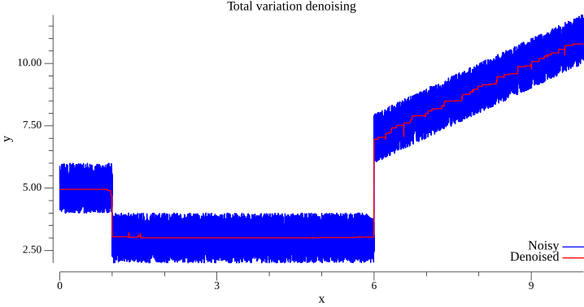

# tvd
Total Variation Denoising filter. 

- Ideal for capturing edges.
- Varying signals may artifact with "staircase effect", see image.




### Usage (1D)
```go
    const lambda = 2
    var noisyData []float64 = getData()
    denoised := tvd.Denoise1D(noisyData, lambda)
    fmt.Println(denoised)
```

